# 短视频自动生成工具 🎬

一个完全自动化的短视频生成系统，专门用于生成民间故事/历史剧情类短视频。只需输入一个主题，即可自动生成包含文案、配音、图片、字幕的完整视频。

## ✨ 核心功能

### 🎯 全自动化工作流

```mermaid
flowchart TD
    Start([用户输入主题<br/>例如: 明朝锦衣卫]) --> A[智能策划模块<br/>Planner]

    A --> A1{分析主题<br/>选择风格类型}
    A1 --> A2[生成叙事结构<br/>设计情绪曲线<br/>提取核心要素]
    A2 --> A3[输出: StyleAnalysis<br/>风格+结构+情绪]

    A3 --> B[文案创作模块<br/>Writer]
    B --> B1[7段式叙事创作<br/>1.震撼开头 2.角色设定<br/>3.危机突发 4.希望破灭<br/>5.极端选择 6.真相反转<br/>7.宿命结尾]
    B1 --> B2[第二人称视角<br/>每行15-22字<br/>强情绪+高反转]
    B2 --> B3[输出: Script<br/>1000+字口播稿]

    B3 --> C[标题生成模块<br/>Title Generator]
    C --> C1[提取情绪钩子<br/>分析反转爆点]
    C1 --> C2[生成5个候选标题<br/>强设问/强视觉/强悬念<br/>强对比/强冲突]
    C2 --> C3[智能评分排序<br/>输出: TitleCandidate×5]

    B3 --> D[语音合成模块<br/>TTS Engine]
    D --> D1[文案分段处理<br/>清理特殊符号]
    D1 --> D2[Edge TTS生成音频<br/>支持多种中文语音]
    D2 --> D3[自动时间对齐<br/>合并音频片段]
    D3 --> D4[输出: AudioSegment<br/>MP3音频文件列表]

    B3 --> E[图片生成模块<br/>Visual Generator]
    E --> E1[LLM生成场景描述<br/>根据文案内容]
    E1 --> E2[DALL-E 3生成图片<br/>1792x1024横屏]
    E2 --> E3[失败降级处理<br/>使用占位图]
    E3 --> E4[输出: VisualSegment<br/>PNG场景图片列表]

    D4 --> F[字幕生成模块<br/>Subtitle Generator]
    F --> F1[根据音频时间<br/>自动分段对齐]
    F1 --> F2[生成SRT/ASS格式<br/>自定义样式]
    F2 --> F3[输出: SubtitleSegment<br/>字幕文件列表]

    D4 --> G[视频合成模块<br/>Compositor]
    E4 --> G
    F3 --> G

    G --> G1[创建视频片段<br/>图片序列+时长]
    G1 --> G2[添加字幕层<br/>位置+样式+时间]
    G2 --> G3[合并音频轨道<br/>音视频同步]
    G3 --> G4[FFmpeg编码输出<br/>1080x1920竖屏MP4]

    G4 --> End([✅ 成品视频<br/>可直接发布])

    C3 -.标题.-> End

    style Start fill:#e1f5e1,stroke:#4caf50,stroke-width:3px
    style End fill:#e3f2fd,stroke:#2196f3,stroke-width:3px
    style A fill:#fff3e0,stroke:#ff9800,stroke-width:2px
    style B fill:#fce4ec,stroke:#e91e63,stroke-width:2px
    style C fill:#f3e5f5,stroke:#9c27b0,stroke-width:2px
    style D fill:#e8f5e9,stroke:#4caf50,stroke-width:2px
    style E fill:#e0f2f1,stroke:#009688,stroke-width:2px
    style F fill:#fff9c4,stroke:#ffc107,stroke-width:2px
    style G fill:#e1bee7,stroke:#9c27b0,stroke-width:2px

    style A1 fill:#ffe0b2,stroke:#ff9800
    style A2 fill:#ffe0b2,stroke:#ff9800
    style A3 fill:#ffe0b2,stroke:#ff9800
    style B1 fill:#f8bbd0,stroke:#e91e63
    style B2 fill:#f8bbd0,stroke:#e91e63
    style B3 fill:#f8bbd0,stroke:#e91e63
    style C1 fill:#e1bee7,stroke:#9c27b0
    style C2 fill:#e1bee7,stroke:#9c27b0
    style C3 fill:#e1bee7,stroke:#9c27b0
    style D1 fill:#c8e6c9,stroke:#4caf50
    style D2 fill:#c8e6c9,stroke:#4caf50
    style D3 fill:#c8e6c9,stroke:#4caf50
    style D4 fill:#c8e6c9,stroke:#4caf50
    style E1 fill:#b2dfdb,stroke:#009688
    style E2 fill:#b2dfdb,stroke:#009688
    style E3 fill:#b2dfdb,stroke:#009688
    style E4 fill:#b2dfdb,stroke:#009688
    style F1 fill:#fff59d,stroke:#ffc107
    style F2 fill:#fff59d,stroke:#ffc107
    style F3 fill:#fff59d,stroke:#ffc107
    style G1 fill:#ce93d8,stroke:#9c27b0
    style G2 fill:#ce93d8,stroke:#9c27b0
    style G3 fill:#ce93d8,stroke:#9c27b0
    style G4 fill:#ce93d8,stroke:#9c27b0
```



**流程说明**：
- 🟢 **绿色节点** - 开始/结束
- 🟠 **橙色模块** - 智能策划（AI分析）
- 🔴 **粉色模块** - 文案创作（AI写作）
- 🟣 **紫色模块** - 标题生成（AI提取）
- 🟢 **绿色模块** - 语音合成（TTS）
- 🔵 **青色模块** - 图片生成（AI绘图）
- 🟡 **黄色模块** - 字幕生成（对齐）
- 🟣 **紫色模块** - 视频合成（编码）

### 📋 功能模块

1. **智能策划** - 分析主题，自动生成适合的风格和叙事结构
   - 权力结构型
   - 市井羞辱型
   - 极端人性抉择
   - 社会机制型
   - 命运反转型
   - 悬疑揭秘型

2. **文案创作** - 生成1000+字的专业口播稿
   - 第二人称视角（"你是..."）
   - 强情绪 + 高反转
   - 7段式叙事结构
   - 每行15-22字，适配字幕

3. **爆款标题** - 自动提取情绪钩子
   - 强设问/强视觉/强悬念
   - 12-22字黄金长度
   - 多个候选方案

4. **语音合成** - 高质量中文配音
   - 支持Edge TTS（免费）
   - 支持Azure TTS（可选）
   - 自动分段和时间对齐

5. **图片生成** - AI生成历史场景图
   - 支持DALL-E 3
   - 支持Stable Diffusion
   - 智能场景描述

6. **字幕生成** - 专业字幕效果
   - SRT/ASS格式
   - 可自定义样式
   - 自动时间对齐

7. **视频合成** - 一键合成成片
   - 9:16竖屏（抖音/快手）
   - 1080x1920高清
   - 音视频完美同步

## 🚀 快速开始

### 1. 环境要求

- Python 3.9+
- FFmpeg（必须）
- ImageMagick（可选，用于字幕渲染）

### 2. 安装

```bash
# 克隆项目
git clone <repository-url>
cd auto-short-video-generator

# 安装依赖
pip install -r requirements.txt

# 配置环境变量
cp .env.example .env
# 编辑 .env 文件，填入你的API密钥
```

### 3. 配置API密钥

编辑 `.env` 文件：

```bash
# OpenAI API（必需，用于文案生成和图片生成）
OPENAI_API_KEY=sk-your-api-key-here

# 可选：使用自定义OpenAI兼容接口
OPENAI_BASE_URL=https://api.openai.com/v1

# 可选：Anthropic Claude API
ANTHROPIC_API_KEY=your-anthropic-key-here
```

### 4. 运行

```bash
# 基础用法
python main.py "明朝锦衣卫"

# 指定配置文件
python main.py "古代特殊职业" --config config/config.yaml

# 开启调试模式
python main.py "历史奇案" --debug
```

## 📖 使用示例

### 示例1：生成锦衣卫主题视频

```bash
python main.py "明朝锦衣卫的秘密任务"
```

**输出：**
- 标题：《锦衣卫抓到自己亲爹，皇帝却下令必须杀》
- 视频时长：2分30秒
- 文案字数：1200字
- 场景数：12个

### 示例2：生成古代职业视频

```bash
python main.py "古代最危险的职业"
```

**输出：**
- 标题：《这个职业干一天就得死，却有人抢着做》
- 视频时长：3分钟
- 文案字数：1500字
- 场景数：15个

## 🎨 自定义配置

编辑 `config/config.yaml` 可以自定义各种参数：

```yaml
# 视频分辨率
video:
  resolution: [1080, 1920]  # 竖屏 9:16
  fps: 30

# 字幕样式
subtitle:
  font: "SimHei"
  font_size: 48
  font_color: "white"
  stroke_color: "black"

# 文案要求
script:
  min_words: 1000
  max_words: 1500
```

## 📁 项目结构

```
auto-short-video-generator/
├── src/
│   ├── planner/          # 智能策划
│   ├── writer/           # 文案创作
│   ├── title_generator/  # 标题生成
│   ├── tts/              # 语音合成
│   ├── visual/           # 图片生成
│   ├── subtitle/         # 字幕生成
│   ├── compositor/       # 视频合成
│   └── workflow/         # 工作流引擎
├── prompts/              # AI提示词模板
├── config/               # 配置文件
├── output/               # 输出目录
│   ├── videos/          # 最终视频
│   ├── audio/           # 音频文件
│   ├── images/          # 图片素材
│   ├── subtitles/       # 字幕文件
│   └── scripts/         # 文案文本
├── main.py              # 主入口
└── requirements.txt     # 依赖列表
```

## 🔧 高级功能

### 只生成文案（不生成视频）

修改代码可以只运行部分流程：

```python
from src.workflow import VideoPipeline

pipeline = VideoPipeline()
theme = VideoTheme(topic="明朝锦衣卫")

# 只执行策划和文案
style = pipeline.planner.analyze_theme(theme)
script = pipeline.writer.write_script(theme, style)
print(script.content)
```

### 批量生成

```bash
# 创建主题列表
cat topics.txt
明朝锦衣卫
古代特殊职业
历史奇案
...

# 批量生成
while read topic; do
  python main.py "$topic"
done < topics.txt
```

## 🎯 爆款公式

本工具内置的爆款公式：

### 文案结构（7段式）

1. **震撼开头** - 第二人称强代入
2. **角色设定** - 身份地位处境
3. **危机突发** - 矛盾激化
4. **希望破灭** - 情绪跌落
5. **极端选择** - 道德困境
6. **真相反转** - 颠覆认知
7. **宿命结尾** - 引人思考

### 标题钩子

- **强设问**："你知道XXX吗？"
- **强视觉**：具体冲击场景
- **强悬念**："真相竟然是..."
- **强对比**："明明XXX，却XXX"
- **强冲突**："必须XXX，否则XXX"

## 💡 常见问题

### Q: 生成一个视频需要多久？
A: 通常2-5分钟，取决于：
- LLM响应速度（文案生成）
- 图片生成速度（DALL-E较慢）
- 视频时长

### Q: 生成成本多少？
A: 估算单个视频成本：
- OpenAI GPT-4: ~$0.5-1.0（文案+场景描述）
- DALL-E 3: ~$0.4-0.8（10-15张图）
- Edge TTS: 免费
- **总计**: ~$1-2/视频

### Q: 可以用国产大模型吗？
A: 可以！修改配置使用OpenAI兼容接口：
```yaml
api:
  llm_provider: openai
  openai_model: your-model
# .env中设置
OPENAI_BASE_URL=https://your-api-endpoint
```

### Q: 图片生成失败怎么办？
A: 工具会自动创建占位图，确保流程不中断。可以后期替换。

### Q: 可以添加背景音乐吗？
A: 目前版本暂不支持，可以用剪映等工具后期添加。

## 🛠️ 开发指南

### 添加新的风格类型

1. 编辑 `config/config.yaml`：
```yaml
script:
  style_types:
    - "你的新风格"
```

2. 修改 `prompts/planner_prompt.txt` 添加风格描述

### 支持新的TTS引擎

在 `src/tts/tts_engine.py` 中添加：

```python
def _generate_with_custom_tts(self, script, output_name):
    # 你的TTS实现
    pass
```

### 支持新的图片生成器

在 `src/visual/visual_generator.py` 中添加：

```python
def _generate_with_stable_diffusion(self, description, output_path):
    # Stable Diffusion实现
    pass
```

## 📊 性能优化

### 加速生成

1. **使用本地模型**
   - 文案生成：本地部署Qwen/GLM等
   - 图片生成：本地Stable Diffusion

2. **并行处理**
   - 图片生成可并行
   - 音频分段可并行

3. **缓存机制**
   - 相似主题复用场景描述
   - 图片素材库

## 🤝 贡献

欢迎提交Issue和PR！

## 📄 许可证

MIT License

## 🙏 致谢

- OpenAI GPT-4 - 文案生成
- DALL-E 3 - 图片生成
- Edge TTS - 语音合成
- MoviePy - 视频处理
- FFmpeg - 音视频编码

---

**打造爆款短视频，从这里开始！** 🎬✨
