# 工作流程图详解 📊

## 完整流程图

以下是短视频自动生成工具的完整工作流程图（在GitHub上会自动渲染为彩色高清图表）：

```mermaid
flowchart TD
    Start([📥 用户输入<br/>主题关键词]) -->|主题文本| A[🎯 主题分析<br/>工具: GPT-4]

    A -->|主题+上下文| A1[📊 风格匹配<br/>工具: LLM推理]
    A1 -->|风格类型| A2[📝 结构设计<br/>工具: 提示词工程]
    A2 -->|StyleAnalysis对象| B[✍️ 文案创作<br/>工具: GPT-4]

    B -->|风格+主题| B1[🎭 7段式叙事<br/>工具: LLM生成]
    B1 -->|原始文案| B2[🔧 文案优化<br/>工具: 格式处理]
    B2 -->|Script对象| C[🏆 标题生成<br/>工具: GPT-4]

    B2 -->|完整文案| D[🎙️ 语音合成<br/>工具: Edge TTS]
    B2 -->|文案内容| E[🎨 图片生成<br/>工具: DALL-E 3]

    C -->|文案内容| C1[🎣 提取钩子<br/>工具: LLM分析]
    C1 -->|情绪点列表| C2[📋 候选生成<br/>工具: LLM创作]
    C2 -->|5个标题| C3[⭐ 智能评分<br/>工具: LLM评估]
    C3 -->|最佳标题| End

    D -->|文案分段| D1[🔪 文本分割<br/>工具: 正则处理]
    D1 -->|文本片段| D2[🗣️ TTS转换<br/>工具: Edge TTS]
    D2 -->|音频片段| D3[⏱️ 时间对齐<br/>工具: Pydub]
    D3 -->|AudioSegment列表| F[📝 字幕生成<br/>工具: 时间轴处理]

    E -->|文案+风格| E1[🖼️ 场景描述<br/>工具: GPT-4]
    E1 -->|英文Prompt| E2[🎨 AI绘图<br/>工具: DALL-E 3]
    E2 -->|图片URL| E3[💾 图片下载<br/>工具: HTTP请求]
    E3 -->|VisualSegment列表| G

    D3 -->|音频+时间| F
    F -->|音频时间轴| F1[✂️ 字幕分段<br/>工具: 自动对齐]
    F1 -->|时间+文本| F2[📄 格式生成<br/>工具: SRT/ASS]
    F2 -->|SubtitleSegment列表| G

    G[🎬 视频合成<br/>工具: MoviePy] -->|图片+时长| G1[📹 片段创建<br/>工具: ImageClip]
    G1 -->|视频片段| G2[📝 添加字幕<br/>工具: TextClip]
    G2 -->|视频+字幕| G3[🔊 音频合并<br/>工具: AudioClip]
    G3 -->|完整视频| G4[📦 编码输出<br/>工具: FFmpeg]
    G4 -->|MP4文件| End([✅ 成品视频<br/>1080x1920竖屏])

    style Start fill:#e1f5e1,stroke:#4caf50,stroke-width:3px
    style End fill:#e3f2fd,stroke:#2196f3,stroke-width:3px

    style A fill:#fff3e0,stroke:#ff9800,stroke-width:2px
    style A1 fill:#ffe0b2,stroke:#ff9800,stroke-width:2px
    style A2 fill:#ffe0b2,stroke:#ff9800,stroke-width:2px

    style B fill:#fce4ec,stroke:#e91e63,stroke-width:2px
    style B1 fill:#f8bbd0,stroke:#e91e63,stroke-width:2px
    style B2 fill:#f8bbd0,stroke:#e91e63,stroke-width:2px

    style C fill:#f3e5f5,stroke:#9c27b0,stroke-width:2px
    style C1 fill:#e1bee7,stroke:#9c27b0,stroke-width:2px
    style C2 fill:#e1bee7,stroke:#9c27b0,stroke-width:2px
    style C3 fill:#e1bee7,stroke:#9c27b0,stroke-width:2px

    style D fill:#e8f5e9,stroke:#4caf50,stroke-width:2px
    style D1 fill:#c8e6c9,stroke:#4caf50,stroke-width:2px
    style D2 fill:#c8e6c9,stroke:#4caf50,stroke-width:2px
    style D3 fill:#c8e6c9,stroke:#4caf50,stroke-width:2px

    style E fill:#e0f2f1,stroke:#009688,stroke-width:2px
    style E1 fill:#b2dfdb,stroke:#009688,stroke-width:2px
    style E2 fill:#b2dfdb,stroke:#009688,stroke-width:2px
    style E3 fill:#b2dfdb,stroke:#009688,stroke-width:2px

    style F fill:#fff9c4,stroke:#ffc107,stroke-width:2px
    style F1 fill:#fff59d,stroke:#ffc107,stroke-width:2px
    style F2 fill:#fff59d,stroke:#ffc107,stroke-width:2px

    style G fill:#e1bee7,stroke:#9c27b0,stroke-width:2px
    style G1 fill:#ce93d8,stroke:#9c27b0,stroke-width:2px
    style G2 fill:#ce93d8,stroke:#9c27b0,stroke-width:2px
    style G3 fill:#ce93d8,stroke:#9c27b0,stroke-width:2px
    style G4 fill:#ce93d8,stroke:#9c27b0,stroke-width:2px
```



## 节点格式说明

### 🎨 统一格式规范

每个节点采用以下格式：
```
[图标 + 任务目标]
[工具: 具体工具]
```

### 📊 连线标注规范

每条连线标注数据类型：
```
-->|输入/输出数据| 下一节点
```

---

更多详细说明请查看完整文档。
