# 工作流程图详解 📊

## 完整流程图

以下是短视频自动生成工具的完整工作流程图（在GitHub上会自动渲染为彩色高清图表）：

```mermaid
flowchart TD
    Start([📥 用户输入]) -->|主题文本| A[🎯 主题分析]

    A -->|主题+上下文| A1[📊 风格匹配]
    A1 -->|风格类型| A2[📝 结构设计]
    A2 -->|StyleAnalysis| B[✍️ 文案创作]

    B -->|风格+主题| B1[🎭 叙事生成]
    B1 -->|原始文案| B2[🔧 文案优化]
    B2 -->|Script对象| C[🏆 标题生成]

    B2 -->|完整文案| D[🎙️ 语音合成]
    B2 -->|文案内容| E[🎨 图片生成]

    C -->|文案内容| C1[🎣 提取钩子]
    C1 -->|情绪点| C2[📋 生成候选]
    C2 -->|5个标题| C3[⭐ 智能评分]
    C3 -->|最佳标题| End

    D -->|文案分段| D1[🔪 文本分割]
    D1 -->|文本片段| D2[🗣️ 语音转换]
    D2 -->|音频片段| D3[⏱️ 时间对齐]
    D3 -->|音频列表| F[📝 字幕生成]

    E -->|文案+风格| E1[🖼️ 场景描述]
    E1 -->|英文提示词| E2[🎨 AI绘图]
    E2 -->|图片URL| E3[💾 图片下载]
    E3 -->|图片列表| G

    D3 -->|音频+时间| F
    F -->|时间轴| F1[✂️ 字幕分段]
    F1 -->|时间+文本| F2[📄 格式生成]
    F2 -->|字幕列表| G

    G[🎬 视频合成] -->|图片+时长| G1[📹 创建片段]
    G1 -->|视频片段| G2[📝 添加字幕]
    G2 -->|视频+字幕| G3[🔊 音频合并]
    G3 -->|完整视频| G4[📦 编码输出]
    G4 -->|MP4文件| End([✅ 成品视频])

    style Start fill:#e1f5e1,stroke:#4caf50,stroke-width:3px
    style End fill:#e3f2fd,stroke:#2196f3,stroke-width:3px

    style A fill:#fff3e0,stroke:#ff9800,stroke-width:2px
    style A1 fill:#ffe0b2,stroke:#ff9800,stroke-width:2px
    style A2 fill:#ffe0b2,stroke:#ff9800,stroke-width:2px

    style B fill:#fce4ec,stroke:#e91e63,stroke-width:2px
    style B1 fill:#f8bbd0,stroke:#e91e63,stroke-width:2px
    style B2 fill:#f8bbd0,stroke:#e91e63,stroke-width:2px

    style C fill:#f3e5f5,stroke:#9c27b0,stroke-width:2px
    style C1 fill:#e1bee7,stroke:#9c27b0,stroke-width:2px
    style C2 fill:#e1bee7,stroke:#9c27b0,stroke-width:2px
    style C3 fill:#e1bee7,stroke:#9c27b0,stroke-width:2px

    style D fill:#e8f5e9,stroke:#4caf50,stroke-width:2px
    style D1 fill:#c8e6c9,stroke:#4caf50,stroke-width:2px
    style D2 fill:#c8e6c9,stroke:#4caf50,stroke-width:2px
    style D3 fill:#c8e6c9,stroke:#4caf50,stroke-width:2px

    style E fill:#e0f2f1,stroke:#009688,stroke-width:2px
    style E1 fill:#b2dfdb,stroke:#009688,stroke-width:2px
    style E2 fill:#b2dfdb,stroke:#009688,stroke-width:2px
    style E3 fill:#b2dfdb,stroke:#009688,stroke-width:2px

    style F fill:#fff9c4,stroke:#ffc107,stroke-width:2px
    style F1 fill:#fff59d,stroke:#ffc107,stroke-width:2px
    style F2 fill:#fff59d,stroke:#ffc107,stroke-width:2px

    style G fill:#e1bee7,stroke:#9c27b0,stroke-width:2px
    style G1 fill:#ce93d8,stroke:#9c27b0,stroke-width:2px
    style G2 fill:#ce93d8,stroke:#9c27b0,stroke-width:2px
    style G3 fill:#ce93d8,stroke:#9c27b0,stroke-width:2px
    style G4 fill:#ce93d8,stroke:#9c27b0,stroke-width:2px
```



## 节点格式说明

## 短剧分支工作流

为方便在扣子(CoZe)等工作流工具中编排短剧生产，本项目新增 `StoryWorkflowBranch` 分支，步骤如下：


### 步骤说明

| 节点 | 输入 | 输出 | 说明 |
|------|------|------|------|
| create_story | 故事概念 | 完整短剧剧本(JSON) | 由 `StoryCreator` 调用 LLM 输出标题、概述、场景和剧本文字 |
| create_role | 剧本文字 | 角色列表(JSON) | `RoleGenerator` 拆解关键角色，附带形象提示词和占位图 URL |
| story_board | 剧本 + 角色 | 分镜列表(JSON) | `StoryboardDesigner` 生成镜头机位、画面描述与台词 |
| video_slice | 分镜信息 | 切片URL列表 | `VideoSlicePlanner` 将分镜映射到视频切片资源 |
| final_output | 切片URL列表 | 最终视频URL | `FinalAssembler` 汇总切片形成最终视频占位地址 |

### 🎨 统一格式规范

每个节点采用简洁格式（≤10字）：
```
[图标 + 任务名称]
```

### 📊 连线标注规范

每条连线标注数据类型：
```
-->|输入/输出数据| 下一节点
```

### 🛠️ 执行工具映射

| 模块 | 节点 | 执行工具 |
|------|------|----------|
| 🟠 策划 | 主题分析/风格匹配/结构设计 | GPT-4 + 提示词工程 |
| 🔴 文案 | 文案创作/叙事生成/文案优化 | GPT-4 + 格式处理 |
| 🟣 标题 | 提取钩子/生成候选/智能评分 | GPT-4 LLM |
| 🟢 语音 | 文本分割/语音转换/时间对齐 | Edge TTS + Pydub |
| 🔵 图片 | 场景描述/AI绘图/图片下载 | GPT-4 + DALL-E 3 |
| 🟡 字幕 | 字幕生成/字幕分段/格式生成 | Python + SRT/ASS |
| 🟣 视频 | 创建片段/添加字幕/音频合并/编码输出 | MoviePy + FFmpeg |

---

更多详细说明请查看完整文档。
