# 工作流程图详解 📊

## 完整流程图

以下是短视频自动生成工具的完整工作流程图（在GitHub上会自动渲染为彩色高清图表）：

```mermaid
flowchart TD
    Start([用户输入主题<br/>例如: 明朝锦衣卫]) --> A[智能策划模块<br/>Planner]

    A --> A1{分析主题<br/>选择风格类型}
    A1 --> A2[生成叙事结构<br/>设计情绪曲线<br/>提取核心要素]
    A2 --> A3[输出: StyleAnalysis<br/>风格+结构+情绪]

    A3 --> B[文案创作模块<br/>Writer]
    B --> B1[7段式叙事创作<br/>1.震撼开头 2.角色设定<br/>3.危机突发 4.希望破灭<br/>5.极端选择 6.真相反转<br/>7.宿命结尾]
    B1 --> B2[第二人称视角<br/>每行15-22字<br/>强情绪+高反转]
    B2 --> B3[输出: Script<br/>1000+字口播稿]

    B3 --> C[标题生成模块<br/>Title Generator]
    C --> C1[提取情绪钩子<br/>分析反转爆点]
    C1 --> C2[生成5个候选标题<br/>强设问/强视觉/强悬念<br/>强对比/强冲突]
    C2 --> C3[智能评分排序<br/>输出: TitleCandidate×5]

    B3 --> D[语音合成模块<br/>TTS Engine]
    D --> D1[文案分段处理<br/>清理特殊符号]
    D1 --> D2[Edge TTS生成音频<br/>支持多种中文语音]
    D2 --> D3[自动时间对齐<br/>合并音频片段]
    D3 --> D4[输出: AudioSegment列表<br/>MP3音频文件]

    B3 --> E[图片生成模块<br/>Visual Generator]
    E --> E1[LLM生成场景描述<br/>根据文案内容]
    E1 --> E2[DALL-E 3生成图片<br/>1792x1024横屏]
    E2 --> E3[失败降级处理<br/>使用占位图]
    E3 --> E4[输出: VisualSegment列表<br/>PNG场景图片]

    D4 --> F[字幕生成模块<br/>Subtitle Generator]
    F --> F1[根据音频时间<br/>自动分段对齐]
    F1 --> F2[生成SRT/ASS格式<br/>自定义样式]
    F2 --> F3[输出: SubtitleSegment列表<br/>字幕文件]

    D4 --> G[视频合成模块<br/>Compositor]
    E4 --> G
    F3 --> G

    G --> G1[创建视频片段<br/>图片序列+时长]
    G1 --> G2[添加字幕层<br/>位置+样式+时间]
    G2 --> G3[合并音频轨道<br/>音视频同步]
    G3 --> G4[FFmpeg编码输出<br/>1080x1920竖屏MP4]

    G4 --> End([✅ 成品视频<br/>可直接发布])

    C3 -.标题.-> End

    style Start fill:#e1f5e1,stroke:#4caf50,stroke-width:3px
    style End fill:#e3f2fd,stroke:#2196f3,stroke-width:3px
    style A fill:#fff3e0,stroke:#ff9800,stroke-width:2px
    style B fill:#fce4ec,stroke:#e91e63,stroke-width:2px
    style C fill:#f3e5f5,stroke:#9c27b0,stroke-width:2px
    style D fill:#e8f5e9,stroke:#4caf50,stroke-width:2px
    style E fill:#e0f2f1,stroke:#009688,stroke-width:2px
    style F fill:#fff9c4,stroke:#ffc107,stroke-width:2px
    style G fill:#e1bee7,stroke:#9c27b0,stroke-width:2px

    style A1 fill:#ffe0b2,stroke:#ff9800
    style A2 fill:#ffe0b2,stroke:#ff9800
    style A3 fill:#ffe0b2,stroke:#ff9800
    style B1 fill:#f8bbd0,stroke:#e91e63
    style B2 fill:#f8bbd0,stroke:#e91e63
    style B3 fill:#f8bbd0,stroke:#e91e63
    style C1 fill:#e1bee7,stroke:#9c27b0
    style C2 fill:#e1bee7,stroke:#9c27b0
    style C3 fill:#e1bee7,stroke:#9c27b0
    style D1 fill:#c8e6c9,stroke:#4caf50
    style D2 fill:#c8e6c9,stroke:#4caf50
    style D3 fill:#c8e6c9,stroke:#4caf50
    style D4 fill:#c8e6c9,stroke:#4caf50
    style E1 fill:#b2dfdb,stroke:#009688
    style E2 fill:#b2dfdb,stroke:#009688
    style E3 fill:#b2dfdb,stroke:#009688
    style E4 fill:#b2dfdb,stroke:#009688
    style F1 fill:#fff59d,stroke:#ffc107
    style F2 fill:#fff59d,stroke:#ffc107
    style F3 fill:#fff59d,stroke:#ffc107
    style G1 fill:#ce93d8,stroke:#9c27b0
    style G2 fill:#ce93d8,stroke:#9c27b0
    style G3 fill:#ce93d8,stroke:#9c27b0
    style G4 fill:#ce93d8,stroke:#9c27b0
```



## 模块说明

### 🟢 开始/结束节点
- **用户输入主题** - 流程起点
- **成品视频** - 流程终点，可直接发布

### 🟠 智能策划模块 (Planner)
**核心任务**：
1. 分析输入主题，选择最适合的风格类型
2. 生成叙事结构和情绪曲线
3. 提取核心要素

**输出**：`StyleAnalysis` 对象（风格+结构+情绪）

### 🔴 文案创作模块 (Writer)
**核心任务**：
1. 基于7段式叙事结构创作完整文案
2. 使用第二人称视角，强情绪+高反转
3. 每行控制在15-22字，适配字幕显示

**输出**：`Script` 对象（1000+字口播稿）

### 🟣 标题生成模块 (Title Generator)
**核心任务**：
1. 从文案中提取最大情绪钩子
2. 生成5种不同类型的标题候选
3. 智能评分并排序

**输出**：`TitleCandidate列表` 数组（5个标题候选）

### 🟢 语音合成模块 (TTS Engine)
**核心任务**：
1. 将文案分段处理，清理特殊符号
2. 使用Edge TTS生成高质量中文语音
3. 自动时间对齐，合并音频片段

**输出**：`AudioSegment列表` 数组（MP3音频文件）

### 🔵 图片生成模块 (Visual Generator)
**核心任务**：
1. 使用LLM根据文案生成场景描述
2. 调用DALL-E 3生成历史场景图片
3. 失败时使用占位图降级处理

**输出**：`VisualSegment列表` 数组（PNG场景图片）

### 🟡 字幕生成模块 (Subtitle Generator)
**核心任务**：
1. 根据音频时间自动分段对齐
2. 生成SRT/ASS格式字幕文件
3. 应用自定义样式（字体/颜色/描边）

**输出**：`SubtitleSegment列表` 数组（字幕文件）

### 🟣 视频合成模块 (Compositor)
**核心任务**：
1. 创建图片序列视频片段
2. 添加字幕层（位置+样式+时间）
3. 合并音频轨道，确保音视频同步
4. 使用FFmpeg编码输出1080x1920竖屏MP4

**输出**：最终成品视频（MP4文件）

## 数据流向图

```
用户输入主题
       ↓
  智能策划
       ↓
  StyleAnalysis
       ↓
  文案创作
       ↓
     Script ────────┬────────┬────────┐
       │            │        │        │
       ↓            ↓        ↓        ↓
   标题生成    语音合成  图片生成  字幕生成
       ↓            ↓        ↓        ↓
  TitleCandidate  Audio   Visual  Subtitle
                     ↓        ↓        ↓
                     └────────┼────────┘
                              ↓
                         视频合成
                              ↓
                         成品视频
```

## 时间线估算

| 模块 | 预计耗时 | 说明 |
|------|----------|------|
| 智能策划 | 5-10秒 | LLM分析和生成 |
| 文案创作 | 10-30秒 | LLM生成1000+字文案 |
| 标题生成 | 5-10秒 | LLM提取和评分 |
| 语音合成 | 20-40秒 | TTS生成多段音频 |
| 图片生成 | 2-5分钟 | DALL-E生成10-15张图 |
| 字幕生成 | 1-2秒 | 自动对齐和格式化 |
| 视频合成 | 30-60秒 | FFmpeg编码 |
| **总计** | **3-7分钟** | 单个视频 |

## 成本估算

| 项目 | 单价 | 说明 |
|------|------|------|
| GPT-4 文案 | $0.5-1.0 | 约5000 tokens |
| DALL-E 图片 | $0.4-0.8 | 10-15张图 |
| Edge TTS | 免费 | 不限次数 |
| **总计** | **$1-2** | 单个视频 |

## 质量保证

### ✅ 自动验证
- 文案字数检查（1000-1500字）
- 标题长度检查（12-22字）
- 音频时长对齐验证
- 视频编码完整性检查

### 🔄 降级策略
- 图片生成失败 → 使用占位图
- TTS失败 → 使用备用引擎
- 字幕渲染失败 → 仅使用SRT文件

### 📊 输出格式
- 视频：MP4 (H.264)
- 音频：MP3 (AAC)
- 字幕：SRT + ASS
- 文案：TXT
- 元数据：JSON

---

**在线预览流程图**：
- GitHub: 自动渲染
- Mermaid Live: https://mermaid.live/
- VS Code: 安装Mermaid插件

**文档更新**: 2024
**版本**: v1.0
